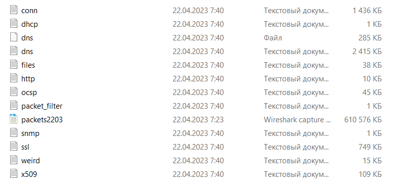
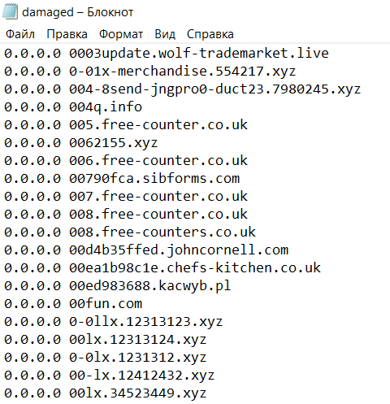
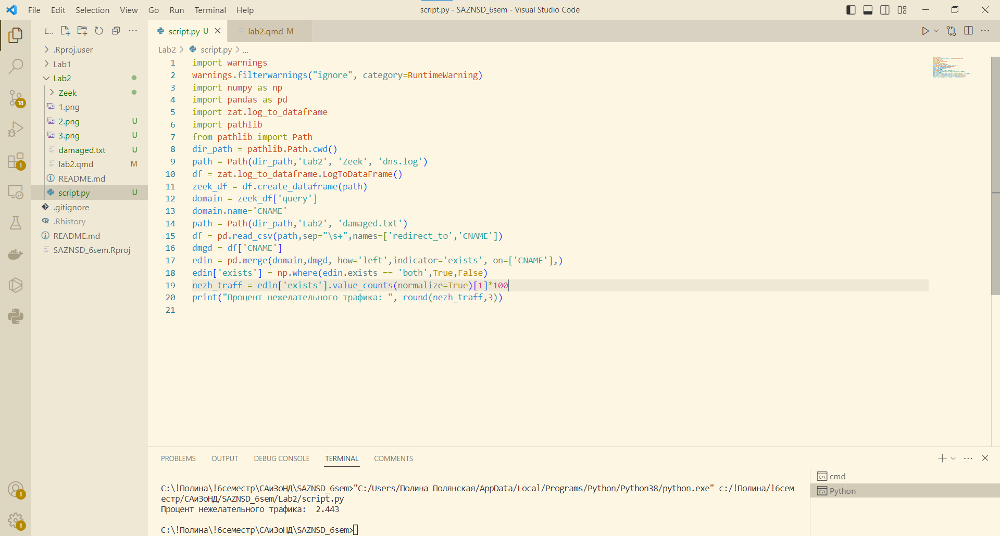

lab2
================
ppolina353@yandex.ru

Сбор и аналитическая обработка информации о сетевом трафике

## Цель

1.  Развить практические навыки использования современного стека
    инструментов сбора и аналитической обработки информации о сетвом
    трафике
2.  Освоить базовые подходы блокировки нежелательного сетевого трафика
3.  Закрепить знания о современных сетевых протоколах прикладного уровня

## Исходные данные

1.  Ноутбук с ОС Windows 10
2.  Приложение Ubuntu on Windows (wsl)
3.  bash
4.  RStudio
5.  Quarto

## Варианты решения задачи

1.  Набирать команды в консоли, делать скрины и вставлять их в отчет в
    Word
2.  Делать чанки со скриптом bash используя Quarto, создавая readme-файл
    с отчетом

## План

1.  Собрать сетевой трафик
2.  Выделить метаинформацию сетевого трафика с помощью утилиты Zeek
3.  Собрать данные об источниках нежелательного трафика
4.  Написать программу, подсчитывающую процент нежелательного трафика
5.  Оформить отчет

## Описание шагов

### Шаг 1

С помощью программы Wireshark собираем трафик. Получаем файл:
packets2203.pcap (596 МБ)


### Шаг 2

С помощью WLS(Ubuntu) и утилиты Zeek получаем метаинформацию о сетевом
трафике



### Шаг 3

Далее берём списки нежелательного трафика с репрозитория [StevenBlack
(Steven Black) · GitHub](https://github.com/StevenBlack)  
И соединяем в файл damaged.txt



### Шаг 4

С помощью программы на Python подсчитываем процент нежелательного
трафика.  
(Сравниваем dns.log и damaged.txt)  
В итоге процент нежелательного трафика: 2.443

``` python

import warnings
warnings.filterwarnings("ignore", category=RuntimeWarning)
import numpy as np
import pandas as pd
import zat.log_to_dataframe
import pathlib
from pathlib import Path
dir_path = pathlib.Path.cwd()
path = Path(dir_path,'Lab2', 'Zeek', 'dns.log')
df = zat.log_to_dataframe.LogToDataFrame()
zeek_df = df.create_dataframe(path)
domain = zeek_df['query']
domain.name='CNAME'
path = Path(dir_path,'Lab2', 'damaged.txt')
df = pd.read_csv(path,sep="\s+",names=['redirect_to','CNAME'])
dmgd = df['CNAME']
edin = pd.merge(domain,dmgd, how='left',indicator='exists', on=['CNAME'],)
edin['exists'] = np.where(edin.exists == 'both',True,False)
nezh_traff = edin['exists'].value_counts(normalize=True)[1]*100
print("Процент нежелательного трафика: ", round(nezh_traff,3))
```



## Оценка результатов

Задача выполнена при помощи утилиты Zeek и программного кода на Python.
Были получены навыки использования инструментов сбора информации о
сетевом трафике, а также её аналитической обработки.

## Вывод

По итогу данной работы мной были освоены базовые подходы работы с
анализом и сбором сетевого трафика.
