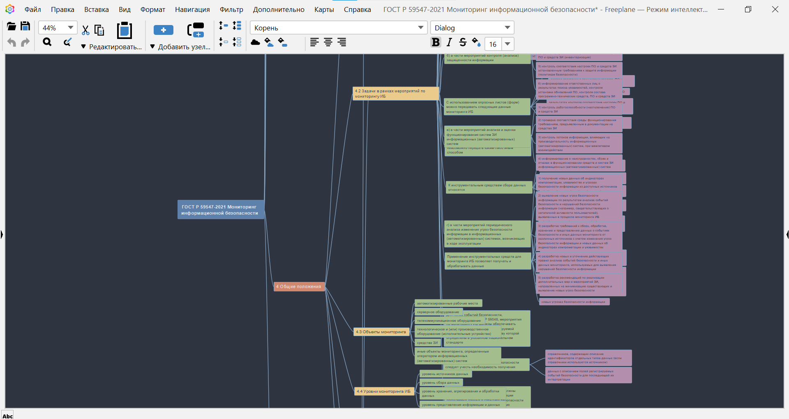

lab5
================
ppolina353@yandex.ru

Создание mind-карты ГОСТа

## Цель

1.  Ознакомиться с Freeplane
2.  Изучить документацию

## Исходные данные

1.  Ноутбук с ОС Windows 10
2.  Freeplane
3.  VS Code
4.  Текст ГОСТ Р 59547-2021

## Варианты решения задачи

1.  Делать конспект в Word-е
2.  Делать mind-карту во Freeplane

## Описание шагов

### Шаг 1

Создание файла с расширением .mm, чтение документа.

### Шаг 2

Создание mind-карты. Фрагмент представлен на рисунке:

Полное отображение mind-карты представлено в .mm-файле по ссылке:
https://github.com/PolyanskayaP/SAZNSD_6sem/blob/main/Lab5/%D0%93%D0%9E%D0%A1%D0%A2%20%D0%A0%2059547-2021%20%D0%9C%D0%BE%D0%BD%D0%B8%D1%82%D0%BE%D1%80%D0%B8%D0%BD%D0%B3%20%D0%B8%D0%BD%D1%84%D0%BE%D1%80%D0%BC%D0%B0%D1%86%D0%B8%D0%BE%D0%BD%D0%BD%D0%BE%D0%B9%20%D0%B1%D0%B5%D0%B7%D0%BE%D0%BF%D0%B0%D1%81%D0%BD%D0%BE%D1%81%D1%82%D0%B8.mm

## Оценка результатов

Задача решена с Freeplane. Я научилась составлять конспекты с помощью
mind-карт.

## Вывод

В данной работе было показано, что удобнее пользоваться современными
средствами конспектирования, такими, как Freeplane.
